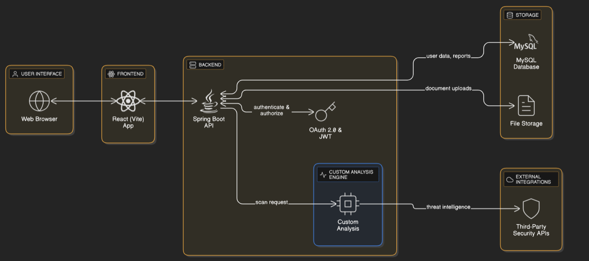

# 🛡️ DeepThreat – Smart Cybersecurity Platform

  
**Version:** 1.0 (Stable but still under development)

---

## 🚀 About DeepThreat
**DeepThreat** is an advanced **cybersecurity web platform** that helps users stay safe from online threats by scanning URLs and documents in real time.  

It uses **custom-built algorithms** along with trusted **third-party APIs** that analyze with **100+ security engines and AI tools**. The platform provides **detailed reports, pie chart visualizations, and proper risk analysis** to help users make safe decisions.  

---

## ✨ Features
✅ **URL Scanner**  
- Detects if a given URL is **Malicious, Suspicious, or Safe**  
- Uses **custom algorithms** + **external APIs** (AI-powered)  
- Shows detailed report with **pie chart visualization**

✅ **Document Scanner**  
- Upload files like **PDF, DOC, JPG, etc.**  
- Detects if the document contains **malware or hidden threats**

✅ **Secure Authentication**  
- **OAuth 2.0** login with Google  
- **JWT-based authorization**

✅ **Tech-Driven Analysis**  
- Combines **DeepThreat’s custom analysis engine** + **100+ algorithms from third-party APIs**  
- Provides **comprehensive threat reports**

✅ **User-Friendly Interface**  
- Modern **React (Vite) + TailwindCSS** frontend  
- Smooth dashboard with **charts & reports**  

---

## 🛠️ Tech Stack
- **Frontend:** React (Vite), Tailwind CSS  
- **Backend:** Spring Boot (Java)  
- **Database:** MySQL  
- **Security:** OAuth 2.0, JWT  
- **Other Tools:** Third-party safe APIs for malware scanning  

---

## 📊 How It Works
1. **Enter a URL** → Get instant classification (**Safe / Suspicious / Malicious**)  
2. **Upload a File** → System checks for **malware inside documents**  
3. **View Report** → Detailed analysis + pie chart representation  
4. **Stay Safe** → Make informed decisions before clicking or downloading  

---

## 🌐 Live Demo
🔗 [DeepThreat Website](https://deepthreat.vercel.app/)  

---

## 📅 Roadmap
- [ ] Add **history tracking** of user scans  
- [ ] Implement **real-time threat alerts**  
- [ ] Improve **AI-based document scanning**  
- [ ] Deploy **mobile app version**  
- [ ] Add **multi-language support**  

---

## 📸 Screenshots
_(Add screenshots here once available)_  

---

## 🤝 Contribution
Contributions are welcome!  
1. Fork this repo  
2. Create your feature branch (`git checkout -b feature-xyz`)  
3. Commit your changes (`git commit -m 'Add xyz feature'`)  
4. Push to the branch (`git push origin feature-xyz`)  
5. Open a Pull Request  

---

## 📜 License
This project is licensed under the **Apache License**. See the [LICENSE](LICENSE) file for details..  

---

## 📩 Contact
🔗 **GitHub**: [PralayeshMukherjee](https://github.com/PralayeshMukherjee)  
🔗 **LinkedIn**: [Connect with me](https://www.linkedin.com/in/pralayesh-mukherjee-756a8b276/)  
💡 Have suggestions? Let's innovate together! 🚀📚

## 🌍 Architecture Diagram

---
